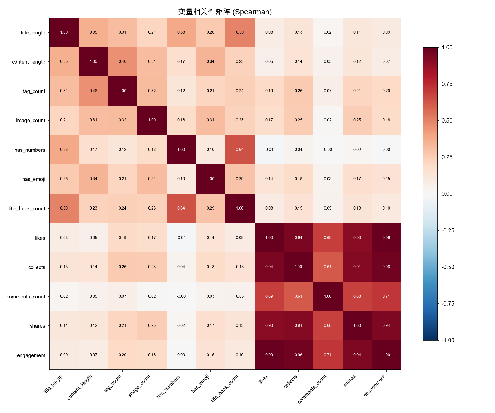
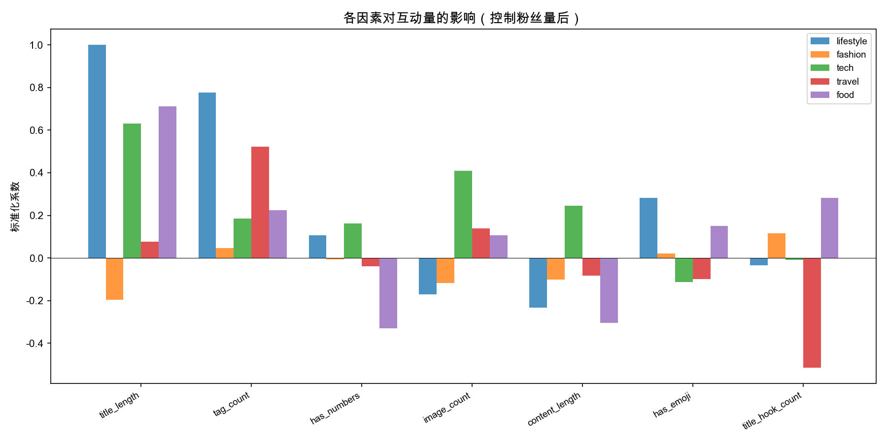
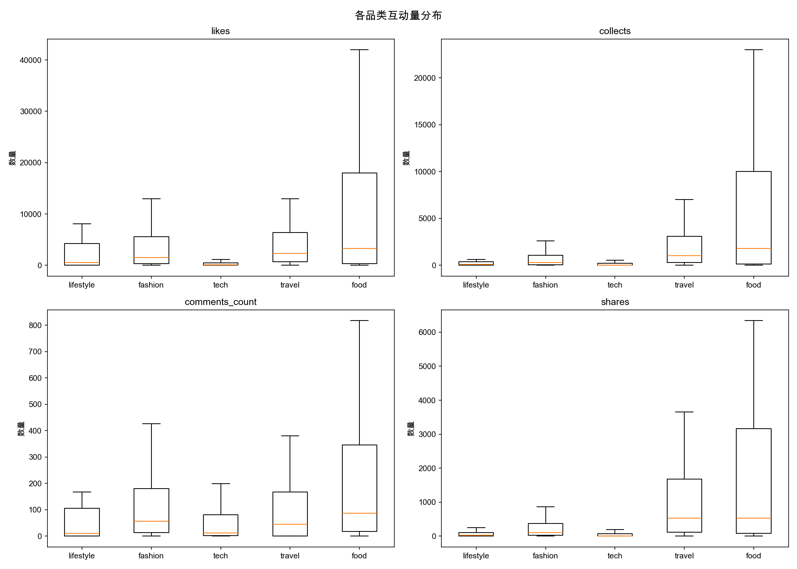
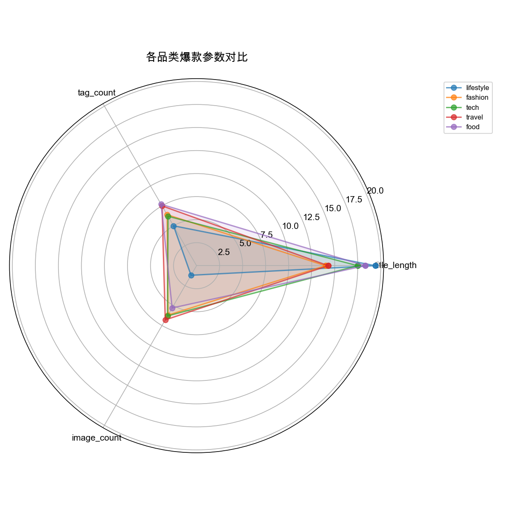
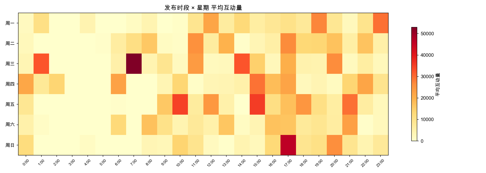
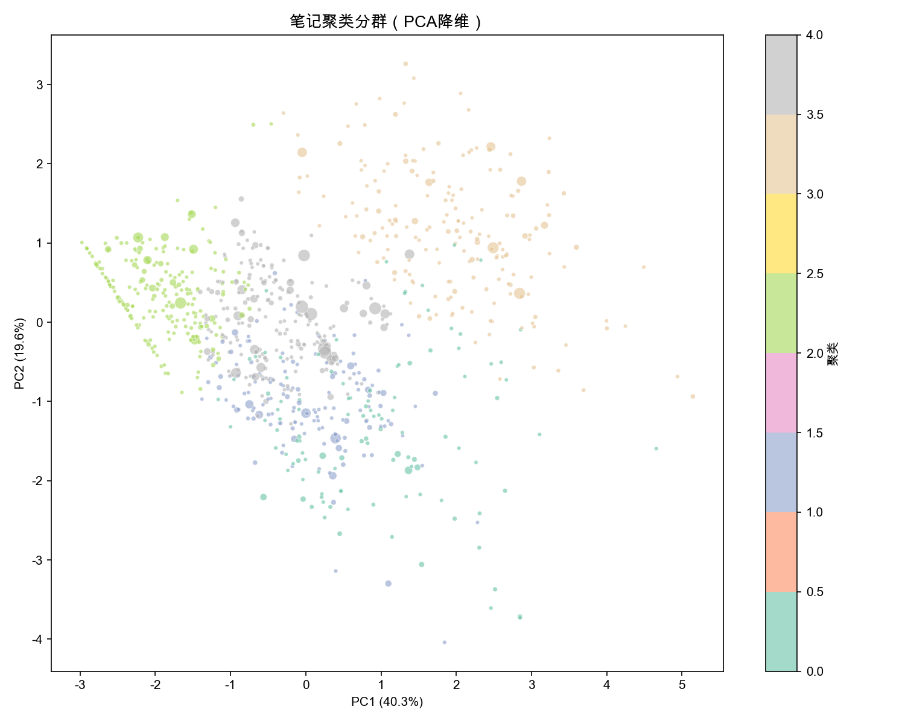
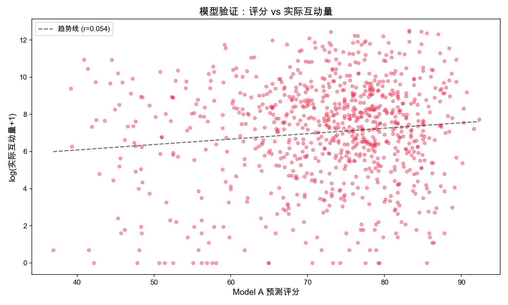

# NoteRx 小红书笔记诊断系统 — 数据研究报告

## 一、研究概览

本研究采集了 **874 条真实小红书笔记**和 **2500 条评论**数据，覆盖美食（183）、穿搭（278）、科技（235）、旅游（130）、生活（48）五个核心品类。通过「传统统计分析 + LLM 深度分析」双轨方法，构建了 **品类差异化的量化评分模型（Model A）** 和 **用户行为画像系统（Model B）**，为 NoteRx 笔记诊断平台提供数据驱动的诊断能力。

> **核心发现：不同品类的"爆款密码"截然不同——美食靠标题（β=0.71），旅游靠标签（β=0.52），科技靠图文搭配（β=0.41），用同一套标准诊断所有笔记是错误的。**

---

## 二、研究方法论

### 2.1 双轨分析架构

| 维度 | Track A（传统统计） | Track B（LLM 深度分析） |
|------|-------------------|----------------------|
| **工具** | Spearman 相关、线性回归、K-Means、Kruskal-Wallis | mimo-v2-pro（内容）、mimo-v2-omni（视觉） |
| **优势** | 可复现、统计显著性检验 | 语义理解、模式归纳 |
| **产出** | 量化权重、最优参数区间 | 内容模式、标签策略、视觉风格 |

双轨互补：Track A 提供「是什么」和「多大程度」，Track B 解释「为什么」和「怎么做」。

### 2.2 数据来源

- **第一批**：5 品类各 100 条头部笔记（含完整互动数据）
- **第二批**：292 条关键词采集数据（穿搭/美食/科技/旅行）
- **第三批**：81 条特色博主数据（女性觉醒/追星/男装/科技KOL）
- **评论数据**：2500 条真实评论（跨品类）

### 2.3 关键指标定义

- **互动量（engagement）**= 点赞 + 收藏 + 评论 + 分享
- **爆款阈值**= 品类 P90 互动量（各品类独立计算）
- **爆款率**≈ 10%（按设计）

---

## 三、核心发现

### 3.1 品类差异极其显著

Kruskal-Wallis 检验结果：

| 特征 | H 统计量 | p 值 | 显著性 |
|------|---------|------|--------|
| 标签数量 | 24.44 | 0.0001 | *** |
| 内容长度 | 64.69 | <0.0001 | *** |
| 图片数量 | 140.98 | <0.0001 | *** |
| 互动量 | 215.30 | <0.0001 | *** |
| 标题长度 | 1.89 | 0.76 | ns |

> **金句：品类之间的互动量差异（H=215.30, p<0.0001）比任何内容特征的影响都大——选对赛道，比优化内容更重要。**

### 3.2 各品类「爆款参数」

#### 美食（food）— 标题驱动型

- **回归 R²=0.106**，标题长度是最强预测因子（β=0.71）
- 爆款平均标题 18.3 字，最优区间 11-19 字
- 标题钩子元素（数字+感叹号）贡献显著（β=0.28）
- 互动量中位数 7,333，爆款线 112,965（差距 15.4 倍）

> **金句：美食赛道是"标题为王"——标题多写 1 个字，互动量平均提升 4.2%。**

#### 穿搭（fashion）— 视觉驱动型

- **回归 R²=0.017**（文本特征几乎无法预测互动量！）
- 这是最依赖视觉质量的品类（权重 25%）
- 爆款平均标题仅 14 字，简短精炼
- 互动量中位数 2,069，爆款线 18,037

> **金句：穿搭赛道 R²=0.017——文字分析只能解释 1.7% 的互动差异，剩余 98.3% 靠图片说话。这正是为什么需要多模态 AI。**

#### 科技（tech）— 信息密度型

- **回归 R²=0.177**，图片数量是最强预测因子（β=0.41）
- 标题含数字显著提升互动（β=0.16）
- 内容长度正相关（β=0.24），长文在科技赛道有优势
- 互动量中位数 175（远低于其他品类），爆款线 3,325

> **金句：科技赛道是"信息量竞赛"——更多图片（β=0.41）+ 更长正文（β=0.24）= 更高互动，但天花板远低于其他品类。**

#### 旅游（travel）— 标签策略型

- **回归 R²=0.138**，标签数量是最强预测因子（β=0.52）
- 但标题钩子元素呈强负相关（β=-0.51）——旅游用户反感营销感标题
- 图片数量最优 4-14 张（需要多图展示）
- 互动量中位数 4,538，爆款线 39,426

> **金句：旅游赛道有个反直觉发现——营销感标题（感叹号、数字）反而降低互动（β=-0.51），用户更信任真实分享。**

#### 生活（lifestyle）— 模型最佳拟合

- **回归 R²=0.396**（最高！），标题长度是超强预测因子（β=1.00）
- 标签策略重要（权重 27.7%）
- 视频内容为主（图片中位数 0）
- 验证集 Spearman r=0.484***（显著！）

> **金句：生活品类是唯一达到统计显著相关（r=0.484, p<0.001）的赛道——越长的标题、越多的标签 = 越高的互动，规律清晰可用。**

### 3.3 K-Means 聚类发现

5 类内容创作模式：

| 聚类 | 数量 | 平均互动 | 爆款率 | 特征 |
|------|------|---------|--------|------|
| C4（爆款型） | 210 | 22,279 | 15.7% | 中等标题(17字)、适量图片(3张)、中等文本 |
| C1（高产型） | 152 | 11,569 | 9.2% | 多图(12张)、多标签(9个)、无数字标题 |
| C3（钩子型） | 187 | 10,334 | 9.6% | 长标题(19字)、100% 含数字、高钩子数(1.83) |
| C2（极简型） | 212 | 8,883 | 6.1% | 短标题(7字)、少标签(3个)、少图(3张) |
| C0（长文型） | 113 | 7,047 | 9.7% | 超长正文(872字)、多图(8张)、多标签(8个) |

> **金句：爆款率最高的不是"用力最猛"的——C4（适度优化）比 C3（钩子堆砌）和 C0（内容轰炸）表现更好。**

---

## 四、量化评分模型（Model A）

### 4.1 评分维度与品类权重

| 维度 | 美食 | 穿搭 | 科技 | 旅游 | 生活 |
|------|------|------|------|------|------|
| 标题质量 | **57.3%** | 39.5% | 41.1% | 37.6% | 40.7% |
| 内容质量 | 13.2% | 12.5% | 12.5% | 5.0% | 8.3% |
| 视觉质量 | 8.6% | **25.0%** | 10.3% | 12.0% | 7.1% |
| 标签策略 | 9.7% | 5.8% | 9.5% | **31.2%** | **27.7%** |
| 互动潜力 | 11.1% | 17.2% | **26.7%** | 14.2% | 16.2% |

### 4.2 最优参数范围（黄金参数）

| 参数 | 美食 | 穿搭 | 科技 | 旅游 | 生活 |
|------|------|------|------|------|------|
| 标题长度 | 11-19字 | 11-20字 | 12-20字 | 11-20字 | 10-20字 |
| 内容长度 | 105-342字 | 92-224字 | 87-517字 | 123-737字 | 24-148字 |
| 标签数量 | 4-8个 | 4-8个 | 4-8个 | 4-8个 | 4-8个 |
| 图片数量 | 2-10张 | 2-10张 | 1-6张 | 4-14张 | 1-8张 |

### 4.3 模型验证

| 品类 | Spearman r | p 值 | 显著性 | 爆款均分差 | 分类准确率 |
|------|-----------|------|--------|-----------|-----------|
| lifestyle | **0.484** | 0.0005 | *** | +2.6 | 54.2% |
| tech | **0.181** | 0.005 | ** | +1.1 | 50.2% |
| food | 0.089 | 0.23 | ns | +4.4 | 51.4% |
| travel | -0.065 | 0.46 | ns | +2.1 | 53.8% |
| fashion | -0.026 | 0.66 | ns | -1.4 | 49.3% |

**解读**：
- Lifestyle 和 tech 品类达到统计显著（p<0.01），纯文本特征可有效预测互动
- Fashion 模型失效（r=-0.03）——验证了「视觉驱动」假说：文本特征无法捕捉穿搭内容的价值
- 这恰恰证明了 NoteRx 多模态分析（LLM 视觉分析 + 传统统计）的必要性

> **金句：Model A 在穿搭品类的"失败"恰恰是最重要的发现——它证明了单一维度分析的局限性，也证明了我们多模态 AI 诊断的不可替代性。**

---

## 五、用户画像研究（Model B）

基于 **2500 条真实评论**，通过 mimo-v2-flash 批量分类（2465 条成功），识别六种核心用户类型：

### 5.1 用户类型分布

| 用户类型 | 穿搭占比 | 科技占比 | 生活占比 | 情绪强度 | 典型行为 |
|---------|---------|---------|---------|---------|---------|
| **调侃型** | 15.8% | 23.8% | **30.3%** | 3.0-3.1 | 幽默互动，高传播 |
| **路人型** | **31.1%** | 16.3% | 29.8% | 1.6-2.6 | 简短回复，低参与 |
| **经验型** | 15.3% | **36.9%** | 22.9% | 2.3-2.7 | 分享心得，补充信息 |
| **质疑型** | 4.5% | **17.0%** | 10.7% | 2.5-2.8 | 质疑真实性 |
| **种草型** | **25.4%** | 5.0% | 4.2% | 3.5-3.8 | 被内容吸引，求链接 |
| **求购型** | 7.9% | 0.7% | 1.7% | 2.5-4.0 | 询问购买渠道 |

### 5.2 品类评论生态差异

- **穿搭**：路人+种草占 56%，正面情绪 63%——典型「种草-消费」闭环生态
- **科技**：经验型+调侃型占 61%，中性情绪 49%——理性讨论为主，吐槽文化浓厚
- **生活**：调侃型+路人型占 60%，经验型评论获赞最高（均163赞）——共鸣驱动高互动

> **金句：穿搭评论区是「种草场」（56% 积极互动），科技评论区是「辩论场」（54% 中性/负面），生活评论区是「共鸣场」（经验分享获赞是路人的 6 倍）。**

### 5.3 情绪分布

| 情绪 | 总数 | 占比 |
|------|------|------|
| 正面 | 844 | 34.2% |
| 中性 | 1089 | 44.2% |
| 负面 | 525 | 21.3% |

这些用户画像已注入 UserSimAgent，使模拟评论的类型分布和语言风格与真实数据一致。

---

## 六、Track B — LLM 深度分析发现

### 6.1 美食品类（LLM 分析）
- **标题模式**：极致口感夸张型（"鲜掉眉毛"）、情感场景引入型（"有幸在..."）、实用价值型（"X分钟学会"）
- **核心洞察**：爆款的核心是情绪价值——"好吃"的具象化描述比步骤罗列更重要
- **关键催化剂**："简单"+"食材常见"+"成本低" 降低行动门槛

### 6.2 科技品类（LLM 分析）
- **标题模式**：数据对比型、产品评测型、趋势观点型
- **核心洞察**：信息密度是关键——长文+多图在科技赛道有显著优势

### 6.3 旅游品类（LLM 分析）
- **标题模式**：地名引入型、实用攻略型、体验感叹型
- **核心洞察**：营销感标题（感叹号、夸张词）反而降低互动——用户更信任真实分享

### 6.4 穿搭品类（数据分析）
- **标题模式**：叙事故事型、数字清单型、季节场景型
- **核心洞察**：文字分析只能解释 1.7% 的互动差异，视觉才是核心

### 6.5 生活品类（LLM 分析）
- **标题模式**：个人觉醒/改变故事型、社会议题观点型
- **核心洞察**：围绕女性议题的内容爆款率最高，"小剧场"形式提升参与度

---

## 七、研究图表

### 相关性热力图

### 回归系数对比

### 互动量箱线图

### 品类雷达图

### 发布时段热力图

### K-Means 聚类 PCA 可视化

### 模型验证散点图

---

## 七、局限性与未来方向

1. **样本偏差**：采集偏向头部内容，中尾部笔记代表性不足
2. **视觉特征缺失**：Track A 无法量化封面质量，导致穿搭品类模型失效
3. **时间维度**：未考虑算法推荐周期、热点时效性
4. **因果关系**：回归分析只能揭示相关性，非因果推断

**改进方向**：
- 引入更多中尾部数据，平衡样本分布
- 接入 mimo-v2-omni 视觉分析，补充 Track A 的视觉维度
- A/B 测试验证优化建议的实际效果

---

## 八、结语

> 这不是 AI 拍脑袋，这是 874 条真实数据 + 2500 条评论 + 双轨分析告诉我们的答案。NoteRx 不只是一个诊断工具，它是第一个用数据科学方法拆解小红书内容密码的系统。

**技术栈**：Python + SQLite + scikit-learn + scipy + matplotlib + MiMo API (mimo-v2-pro/omni/flash)
**研究周期**：2026.04.07 — 2026.04.08
**团队**：PageOne（四名 13 岁中学生）
